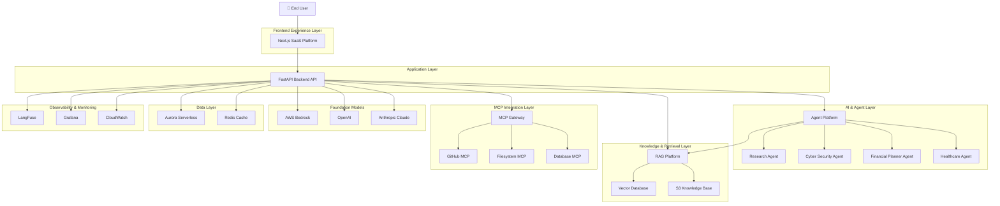

# Enterprise Architecture Landscape

```mermaid
flowchart TB

    User["👤 End User"]

    subgraph Experience["Frontend Experience Layer"]
        Frontend["Next.js SaaS Platform"]
    end

    subgraph Application["Application Layer"]
        Backend["FastAPI Backend API"]
    end

    subgraph Intelligence["AI & Agent Layer"]

        AgentHub["Agent Platform"]

        ResearchAgent["Research Agent"]
        SecurityAgent["Cyber Security Agent"]
        FinanceAgent["Financial Planner Agent"]
        HealthcareAgent["Healthcare Agent"]

        AgentHub --> ResearchAgent
        AgentHub --> SecurityAgent
        AgentHub --> FinanceAgent
        AgentHub --> HealthcareAgent

    end

    subgraph Knowledge["Knowledge & Retrieval Layer"]

        RAG["RAG Platform"]

        VectorDB["Vector Database"]

        S3["S3 Knowledge Base"]

        RAG --> VectorDB
        RAG --> S3

    end

    subgraph MCP["MCP Integration Layer"]

        MCPGateway["MCP Gateway"]

        GitHub["GitHub MCP"]
        Filesystem["Filesystem MCP"]
        Database["Database MCP"]

        MCPGateway --> GitHub
        MCPGateway --> Filesystem
        MCPGateway --> Database

    end

    subgraph Models["Foundation Models"]

        Bedrock["AWS Bedrock"]
        OpenAI["OpenAI"]
        Claude["Anthropic Claude"]

    end

    subgraph Data["Data Layer"]

        Aurora["Aurora Serverless"]
        Redis["Redis Cache"]

    end

    subgraph Observability["Observability & Monitoring"]

        LangFuse["LangFuse"]
        Grafana["Grafana"]
        CloudWatch["CloudWatch"]

    end

    User --> Frontend

    Frontend --> Backend

    Backend --> AgentHub
    Backend --> RAG
    Backend --> MCPGateway

    Backend --> Aurora
    Backend --> Redis

    Backend --> Bedrock
    Backend --> OpenAI
    Backend --> Claude

    AgentHub --> RAG

    Backend --> LangFuse
    Backend --> Grafana
    Backend --> CloudWatch
```

