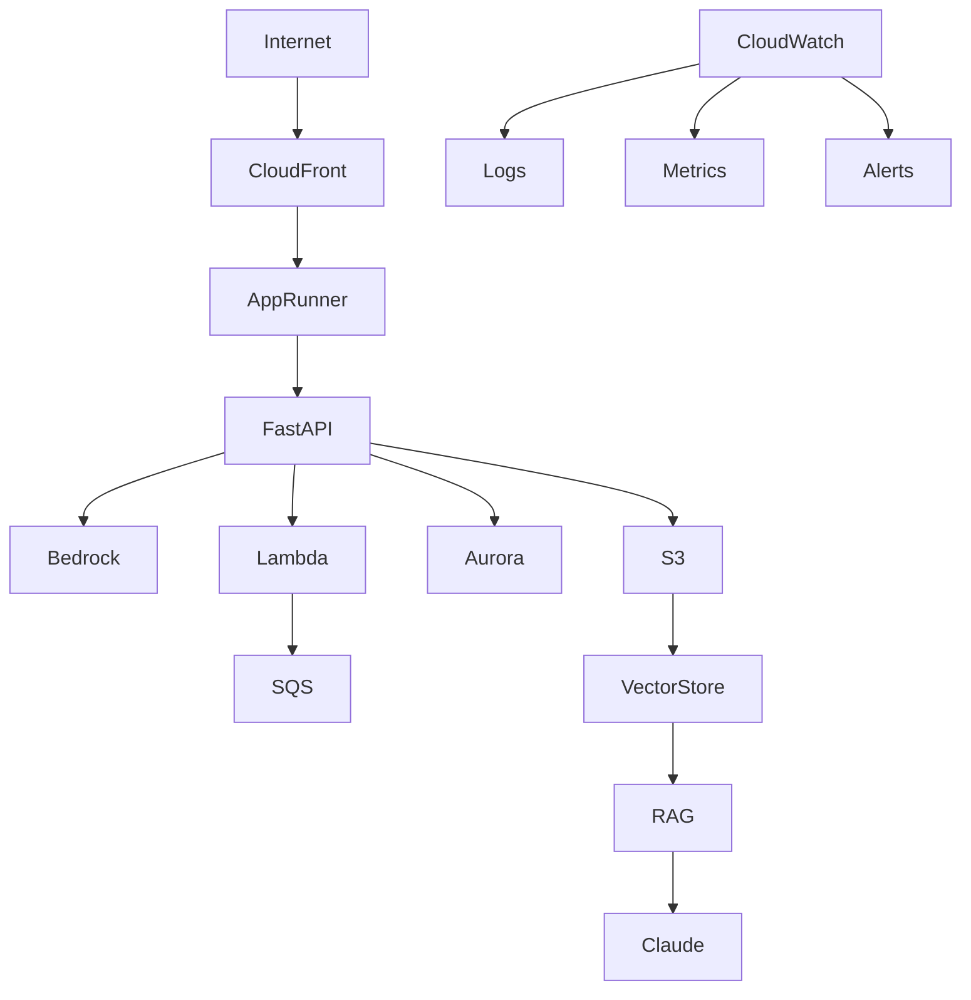

# AWS Platform Architecture

```mermaid
flowchart TB

    Internet

    Internet --> CloudFront

    CloudFront --> AppRunner

    AppRunner --> FastAPI

    FastAPI --> Bedrock

    FastAPI --> Lambda

    FastAPI --> Aurora

    FastAPI --> S3

    Lambda --> SQS

    S3 --> VectorStore

    VectorStore --> RAG

    RAG --> Claude

    CloudWatch --> Logs

    CloudWatch --> Metrics

    CloudWatch --> Alerts
```