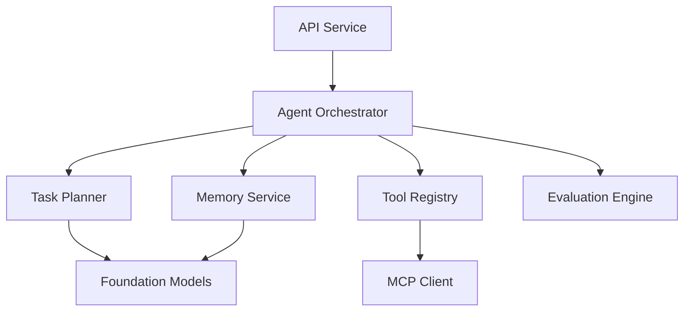

# C4 - Agent Platform Components

```mermaid
flowchart TB

    API["API Service"]

    Orchestrator["Agent Orchestrator"]

    Planner["Task Planner"]

    Memory["Memory Service"]

    ToolRegistry["Tool Registry"]

    MCPClient["MCP Client"]

    Evaluation["Evaluation Engine"]

    LLM["Foundation Models"]

    API --> Orchestrator

    Orchestrator --> Planner

    Orchestrator --> Memory

    Orchestrator --> ToolRegistry

    ToolRegistry --> MCPClient

    Planner --> LLM

    Memory --> LLM

    Orchestrator --> Evaluation
```