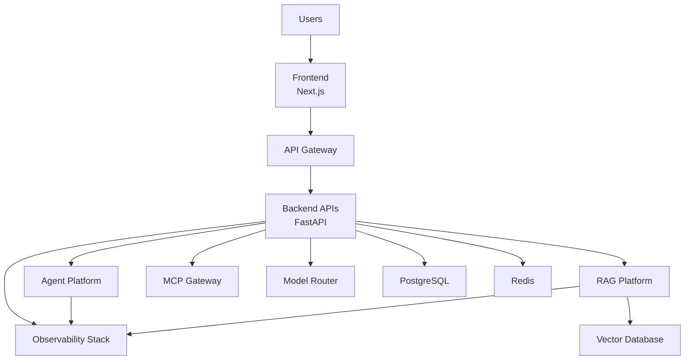

# C4 - Container Diagram

```mermaid
flowchart TB

    User["Users"]

    Frontend["Frontend
    Next.js"]

    APIGateway["API Gateway"]

    Backend["Backend APIs
    FastAPI"]

    Agents["Agent Platform"]

    RAG["RAG Platform"]

    MCP["MCP Gateway"]

    ModelRouter["Model Router"]

    VectorDB["Vector Database"]

    PostgreSQL["PostgreSQL"]

    Redis["Redis"]

    Observability["Observability Stack"]

    User --> Frontend
    Frontend --> APIGateway
    APIGateway --> Backend

    Backend --> Agents
    Backend --> RAG
    Backend --> MCP
    Backend --> ModelRouter

    RAG --> VectorDB

    Backend --> PostgreSQL
    Backend --> Redis

    Backend --> Observability
    Agents --> Observability
    RAG --> Observability
```