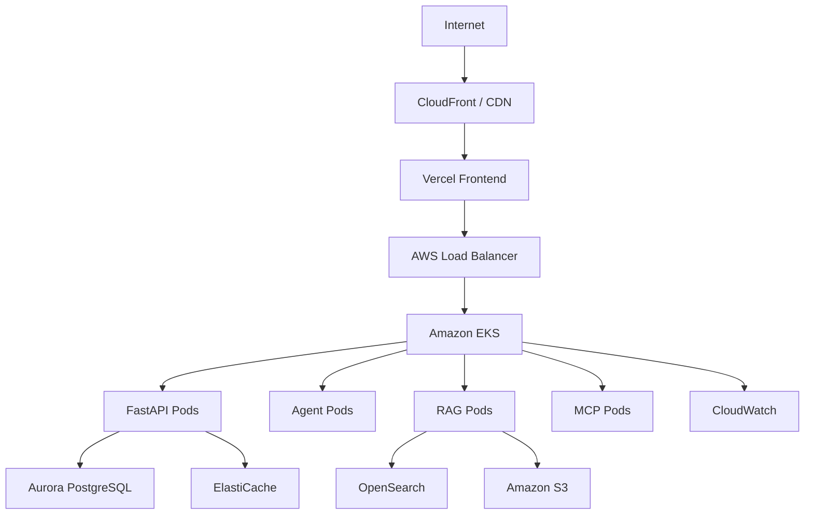

# C4 - Deployment Diagram

```mermaid
flowchart TB

    Internet["Internet"]

    CloudFront["CloudFront / CDN"]

    Vercel["Vercel Frontend"]

    ALB["AWS Load Balancer"]

    EKS["Amazon EKS"]

    FastAPI["FastAPI Pods"]

    Agents["Agent Pods"]

    RAG["RAG Pods"]

    MCP["MCP Pods"]

    Aurora["Aurora PostgreSQL"]

    Redis["ElastiCache"]

    OpenSearch["OpenSearch"]

    S3["Amazon S3"]

    CloudWatch["CloudWatch"]

    Internet --> CloudFront

    CloudFront --> Vercel

    Vercel --> ALB

    ALB --> EKS

    EKS --> FastAPI

    EKS --> Agents

    EKS --> RAG

    EKS --> MCP

    FastAPI --> Aurora
    FastAPI --> Redis

    RAG --> OpenSearch

    RAG --> S3

    EKS --> CloudWatch
```