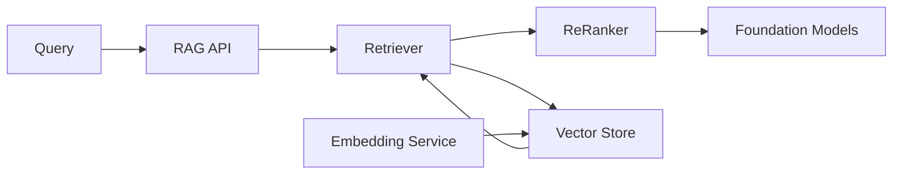

# C4 - RAG Platform Components

```mermaid
flowchart LR

    User["Query"]

    API["RAG API"]

    Retriever["Retriever"]

    ReRanker["ReRanker"]

    Embedding["Embedding Service"]

    VectorDB["Vector Store"]

    LLM["Foundation Models"]

    User --> API

    API --> Retriever

    Retriever --> VectorDB

    VectorDB --> Retriever

    Retriever --> ReRanker

    ReRanker --> LLM

    Embedding --> VectorDB
```