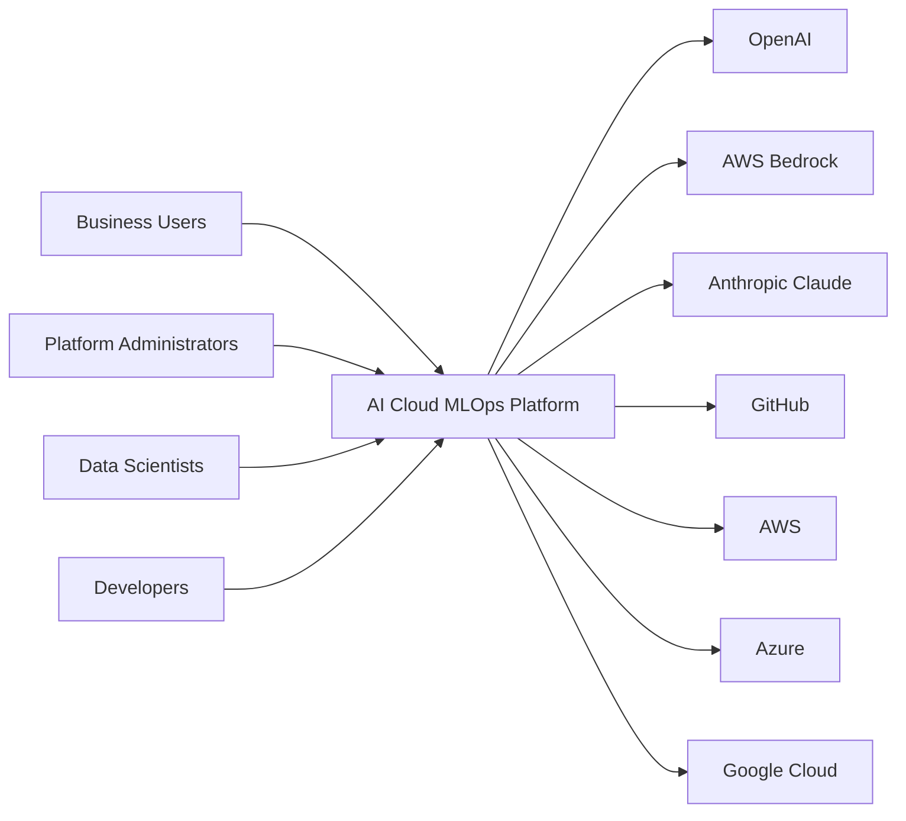

# C4 - System Context Diagram

```mermaid
flowchart LR

    User["Business Users"]
    Admin["Platform Administrators"]
    DataScientist["Data Scientists"]
    Developer["Developers"]

    Platform["AI Cloud MLOps Platform"]

    OpenAI["OpenAI"]
    Bedrock["AWS Bedrock"]
    Claude["Anthropic Claude"]

    Github["GitHub"]
    AWS["AWS"]
    Azure["Azure"]
    GCP["Google Cloud"]

    User --> Platform
    Admin --> Platform
    DataScientist --> Platform
    Developer --> Platform

    Platform --> OpenAI
    Platform --> Bedrock
    Platform --> Claude

    Platform --> Github

    Platform --> AWS
    Platform --> Azure
    Platform --> GCP
```