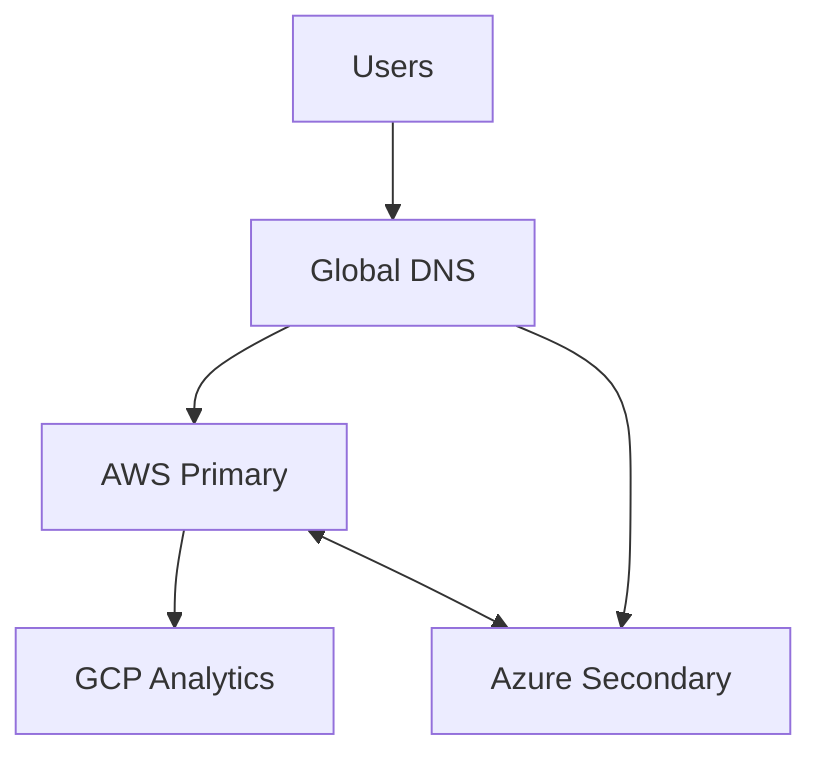

# Multi-Cloud Architecture

```mermaid
flowchart TB

    Users["Users"]

    GlobalDNS["Global DNS"]

    AWS["AWS Primary"]

    Azure["Azure Secondary"]

    GCP["GCP Analytics"]

    Users --> GlobalDNS

    GlobalDNS --> AWS
    GlobalDNS --> Azure

    AWS --> GCP

    AWS <--> Azure
```