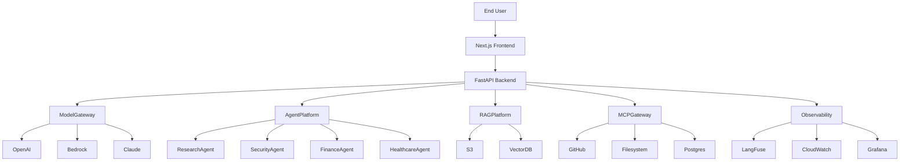

# Platform Overview

```mermaid
flowchart TB

    User[End User]

    User --> Frontend

    Frontend["Next.js Frontend"]

    Frontend --> Backend

    Backend["FastAPI Backend"]

    Backend --> ModelGateway

    Backend --> AgentPlatform

    Backend --> RAGPlatform

    Backend --> MCPGateway

    ModelGateway --> OpenAI

    ModelGateway --> Bedrock

    ModelGateway --> Claude

    AgentPlatform --> ResearchAgent

    AgentPlatform --> SecurityAgent

    AgentPlatform --> FinanceAgent

    AgentPlatform --> HealthcareAgent

    RAGPlatform --> S3

    RAGPlatform --> VectorDB

    MCPGateway --> GitHub

    MCPGateway --> Filesystem

    MCPGateway --> Postgres

    Backend --> Observability

    Observability --> LangFuse

    Observability --> CloudWatch

    Observability --> Grafana
```